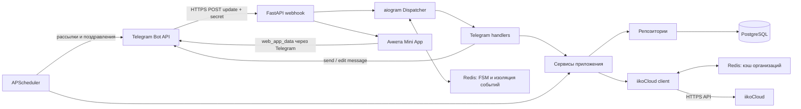
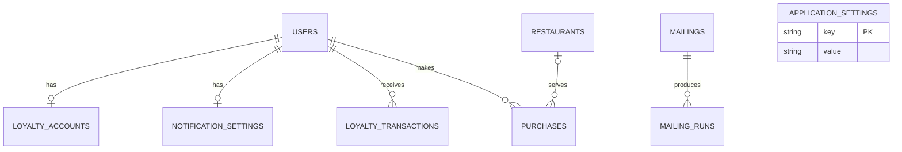

# Клуб «Рыба и Гады» — Telegram-бот программы лояльности

Telegram-бот связывает гостя с программой лояльности iiko, показывает карту, QR-код, бонусный баланс и краткую историю покупок. Администратор управляет рассылками, ссылками и телефонами ресторанов прямо в Telegram.

Бот принимает обновления Telegram через защищённый HTTP webhook. Redis хранит состояния диалогов aiogram и уменьшает количество повторных запросов к production iikoCloud.

## Что реализовано

### Для гостя

- регистрация через собственный Telegram Contact (номер, введённый обычным текстом, не принимается из соображений безопасности);
- поиск существующего гостя iiko по телефону;
- регистрация нового гостя через Telegram Mini App с последующим созданием профиля и карты в iiko;
- личный кабинет, карта и актуальный бонусный баланс;
- быстрый QR-код в первой строке главного меню и дополнительная кнопка QR в личном кабинете;
- история POS-покупок с датой, рестораном, номером и суммой заказа, начисленными и списанными баллами, а также пагинацией;
- выбор заведения для бронирования, отзыва или звонка;
- прямой переход из главного меню к доставке ресторана «Рыба и Гады» в Яндекс Еде.

### Для администратора

- отдельное inline-меню без списка пользователей;
- создание рассылки с текстом и необязательным изображением;
- пагинированный список рассылок по названиям;
- предпросмотр в том же виде, в котором сообщение увидит гость;
- редактирование названия, текста и изображения;
- немедленная и отложенная отправка, отмена и удаление;
- выбор ресторана и настройка резервной ссылки бронирования, отзывов и телефона, а также доставки для ресторана «Рыба и Гады»;
- загрузка и очистка PDF-файлов политики обработки данных и правил программы лояльности;
- команда `/removeme` удаляет профиль администратора только из локальной БД и позволяет заново проверить привязку уже существующего гостя iiko.

## Как идут запросы



Входящего webhook iiko в проекте нет: приложение получает данные iiko исходящими HTTP-запросами и фоновыми задачами.

## Redis и кэш iiko

Redis используется для двух независимых задач:

1. `RedisStorage` aiogram хранит состояния регистрации и создания рассылок. Поэтому состояние FSM сохраняется между процессами и перезапусками.
2. JSON-кэш оборачивает iiko-клиент и не позволяет многократно запрашивать одинаковые относительно стабильные данные.

| Данные | Кэшируются | TTL по умолчанию | Почему |
|---|---:|---:|---|
| список организаций | да | 30 минут | справочник меняется редко |
| карточка гостя и баланс | нет | — | баланс должен оставаться актуальным |
| транзакции | нет | — | используются revision cursor и идемпотентная БД |
| операции записи | нет | — | мутации всегда отправляются непосредственно в iiko |

Ошибка чтения или записи кэша не блокирует запрос iiko, но Redis в целом обязателен для FSM: без него приложение не стартует. TTL справочника задаётся через `IIKO_ORGANIZATIONS_CACHE_TTL_SECONDS`.

## iikoCloud

Production-клиент поддерживает:

- `POST /api/v2/access_token`;
- `POST /api/1/organizations`;
- `POST /api/1/loyalty/iiko/customer/info`;
- `POST /api/1/loyalty/iiko/customer/create_or_update`;
- `POST /api/1/loyalty/iiko/customer/card/add`;
- `POST /api/1/loyalty/iiko/customer/transactions/by_date`;
- `POST /api/1/loyalty/iiko/customer/transactions/by_revision`.

Access token кэшируется в памяти, обновляется до истечения срока и один раз обновляется после `401`. Timeout, ошибки авторизации и серверные ошибки преобразуются в отдельные исключения. Bearer token и credentials в логи не выводятся.

Важные ограничения:

- приложение всегда использует production-клиент iikoCloud;
- если гостя нет в iiko, бот создаёт его через `customer/create_or_update`, передавая анкетные данные, пол и согласия;
- после создания бот генерирует цифровую карту формата `9898XXXX`; `cardTrack` равен номеру карты;
- перед добавлением номер проверяется через `customer/info` с типом `cardNumber` во всех доступных организациях iiko и в локальной БД; при занятом номере генерируется новый;
- `card/add` остаётся окончательной защитой от конкурентного конфликта; если номер успели занять, бот повторяет генерацию;
- если iiko временно недоступна, профиль остаётся локально со статусом `pending`, а фоновая задача позже повторяет создание и привязку;
- пользователь подтверждает владение номером через кнопку Telegram «Поделиться номером»; произвольный текстовый номер к карте не привязывается;
- источником текущего баланса служит `customer/info → walletBalances.balance`, а не сумма транзакций;
- покупка строится по транзакции `CloseOrder`: `orderSum` — сумма чека, `RefillWalletFromOrder` — начисленные баллы, `PayFromWallet` — списанные баллы;
- состав блюд не запрашивается и не отображается; если у транзакции нет `posOrderId`, её нельзя превратить в запись истории покупок;
- бот не создаёт бронь, не хранит её статус и не отправляет подтверждение, а перенаправляет гостя по внешней ссылке;
- для бронирования сначала используется `website_url`, полученный из iiko; если iiko не передала ссылку, бот использует резервную ссылку из настроек ресторана;
- ссылки на отзывы и телефон задаются администратором отдельно для каждого ресторана; ссылка Яндекс Еды настраивается только для ресторана «Рыба и Гады» и открывается прямо из главного меню. Все значения сохраняются в PostgreSQL;
- каталог гостей iiko не равен локальной таблице Telegram-пользователей: локально появляются только взаимодействовавшие с ботом люди.

Названия внутренних систем и технические статусы интеграции не показываются гостю. Интерфейс сообщает только понятное состояние карты: найдена, подключена, создаётся или недоступна.

## Регистрация через Mini App

1. Гость отправляет собственный номер кнопкой Telegram «Поделиться номером».
2. Бот ищет номер в iiko. Найденный профиль привязывается автоматически.
3. Если профиль не найден или iiko недоступен, бот открывает `/registration` кнопкой `web_app`.
4. Анкета запрашивает имя, фамилию, необязательные отчество и e-mail, дату рождения, пол, предпочтительные каналы СМС/PUSH/E-mail и обязательное согласие.
5. Политика и правила загружаются администратором в Telegram как PDF. Перед кнопкой отправки телефона политика автоматически присылается отдельным сообщением тем же файлом, а в анкете документы открываются через `/registration/documents/{document_key}`.
6. Mini App отправляет JSON через `Telegram.WebApp.sendData`. Бот принимает его только в состоянии регистрации, повторно валидирует и связывает с телефоном из Telegram Contact.

После успешной анкеты бот сначала сохраняет профиль локально, затем идемпотентно ищет гостя по телефону и при отсутствии создаёт его в iiko. После чтения созданного профиля бот подбирает свободный номер карты `9898XXXX`, добавляет её в iiko и сохраняет полученные идентификаторы локально. При временной ошибке iiko регистрация не теряется: статус остаётся `pending`, а `pending_iiko` повторяет тот же процесс.

Отсутствие загруженных PDF не блокирует отправку анкеты: названия документов показываются обычным текстом. После загрузки файлов они автоматически становятся доступными перед отправкой телефона и в Mini App.

Выбор каналов хранится в `notification_settings`. Telegram-рассылки и поздравления отправляются только при включённом PUSH. Интеграции отправки СМС и E-mail в проекте не настроены, поэтому эти два значения пока сохраняются как предпочтения пользователя.

## Фоновые задачи

| Задача | Периодичность | Назначение |
|---|---:|---|
| `mailings` | 1 минута | отправка запланированных рассылок |
| `organizations` | 30 минут | синхронизация ресторанов iiko |
| `pending_iiko` | 5 минут | повторное создание/привязка pending-пользователей и их карт |
| `transactions` | `PURCHASE_SYNC_INTERVAL_MINUTES` | синхронизация транзакций и краткой истории покупок |
| `birthdays` | ежедневно в 10:00 | поздравления с днём рождения и праздниками |

## Структура проекта

```text
app/
├── api/                  # health/readiness и Telegram webhook
├── bot/                  # handlers, keyboards, middleware и FSM
├── cache/                # fail-open JSON-кэш Redis
├── integrations/iiko/    # interface, DTO, production и cached clients
├── models/               # SQLAlchemy entities
├── repositories/         # запросы к БД
├── services/             # бизнес-логика
├── web/                  # HTML Telegram Mini App
└── scheduler/            # APScheduler jobs
```

## Схема данных



В PostgreSQL используются таблицы `application_settings`, `users`, `loyalty_accounts`, `loyalty_transactions`, `restaurants`, `purchases`, `notification_settings`, `mailings` и `mailing_runs`.

## Запуск через Docker Compose

Потребуются Docker Desktop, публичный HTTPS-домен или tunnel и Telegram bot token от `@BotFather`.

```powershell
Copy-Item .env.example .env
Copy-Item dockercompose.example.yml compose.yml
```

Заполните как минимум:

```dotenv
BOT_TOKEN=...
ADMIN_IDS=123456789
TELEGRAM_WEBHOOK_URL=https://bot.example.com/telegram/webhook
TELEGRAM_WEBHOOK_PATH=/telegram/webhook
TELEGRAM_WEBHOOK_SECRET=long_random_secret
IIKO_API_KEY=...
IIKO_APP_ID=...
IIKO_CLIENT_SECRET=...
IIKO_DEFAULT_ORGANIZATION_ID=...
```

`TELEGRAM_WEBHOOK_URL` должен быть доступен Telegram из интернета по HTTPS, а его путь должен совпадать с `TELEGRAM_WEBHOOK_PATH`. Это не дублирование: URL регистрируется в Telegram, а PATH задаёт локальный маршрут FastAPI.

```text
Telegram → https://bot.example.com/telegram/webhook → bot:8000/telegram/webhook
```

Секрет допускает только латинские буквы, цифры, `_` и `-`, длина — от 1 до 256 символов. Значение `replace-with-a-random-secret` из `.env.example` нельзя использовать в production.

Запуск и проверка:

```powershell
docker compose up -d --build
docker compose ps
Invoke-RestMethod http://localhost:8000/healthz
Invoke-RestMethod http://localhost:8000/readyz
docker compose logs -f bot
```

- `/healthz` подтверждает работу HTTP-процесса;
- `/readyz` возвращает `200`, когда Redis доступен, и `503`, когда нет;
- внешний reverse proxy должен перенаправлять HTTPS `POST /telegram/webhook` на порт приложения `8000`.
- тот же публичный домен должен открывать `GET /registration`, `GET /registration/config` и `GET /registration/documents/{document_key}` для Mini App.

Остановка без удаления данных PostgreSQL и Redis:

```powershell
docker compose down
```

`compose.yml` и `.env` находятся в `.gitignore`. Версионируются безопасные шаблоны `.env.example` и `dockercompose.example.yml`.

## Локальная разработка через uv

```powershell
uv sync --frozen --group dev
uv run pre-commit run --all-files
uv run --python 3.12 pytest -q
uv run --python 3.12 python -m app.main
```

Для получения настоящих Telegram Updates локальному процессу также нужен публичный HTTPS tunnel. Значение webhook URL нельзя заменять на `localhost`.

Для временной локальной проверки через Cloudflare Quick Tunnel:

```powershell
cloudflared tunnel --url http://localhost:8000
```

Полученный домен `*.trycloudflare.com` нужно записать в `TELEGRAM_WEBHOOK_URL`, добавив `/telegram/webhook`, после чего перезапустить бота. Quick Tunnel имеет временный адрес и не подходит для постоянного production-развёртывания.

## Перед production-развёртыванием

- используйте постоянный HTTPS-домен или именованный Cloudflare Tunnel;
- замените `TELEGRAM_WEBHOOK_SECRET` на случайное непубличное значение;
- задайте отдельный надёжный пароль PostgreSQL вместо шаблонного `loyalty`;
- ограничьте доступ к порту `8000` reverse proxy или firewall;
- настройте резервное копирование PostgreSQL volume;
- выполните команды из раздела «Проверка качества» и проверьте `docker compose logs bot` на ошибки синхронизации iiko.

## Переменные окружения

| Переменная | Обязательность | Назначение |
|---|---:|---|
| `BOT_TOKEN` | всегда | Telegram Bot API token |
| `DATABASE_URL` | всегда | async SQLAlchemy URL |
| `REDIS_URL` | всегда | Redis для FSM и iiko-кэша |
| `TELEGRAM_WEBHOOK_URL` | всегда | полный публичный HTTPS URL webhook |
| `TELEGRAM_WEBHOOK_PATH` | всегда | локальный route; должен совпадать с URL |
| `TELEGRAM_WEBHOOK_SECRET` | всегда | секрет проверки Telegram-запросов |
| `ADMIN_IDS` | рекомендуется | Telegram ID администраторов через запятую |
| `IIKO_BASE_URL` | production | базовый URL iikoCloud |
| `IIKO_API_KEY` | production | API key |
| `IIKO_APP_ID` | production | application ID |
| `IIKO_CLIENT_SECRET` | production | client secret |
| `IIKO_DEFAULT_ORGANIZATION_ID` | production | организация регистрации и revision sync |
| `IIKO_ORGANIZATIONS_CACHE_TTL_SECONDS` | нет | TTL справочника ресторанов |
| `IIKO_TIMEOUT_SECONDS` | нет | timeout запросов iiko |
| `IIKO_TRANSACTION_HISTORY_DAYS` | нет | глубина первичного импорта |
| `IIKO_TRANSACTION_PAGE_SIZE` | нет | размер страницы транзакций |
| `IIKO_CARD_NUMBER_PREFIX` | нет | цифровой префикс карты, сейчас `9898` |
| `IIKO_CARD_NUMBER_LENGTH` | нет | полная длина номера карты, сейчас `8` |
| `IIKO_CARD_GENERATION_ATTEMPTS` | нет | число попыток подобрать свободный номер |
| `PURCHASE_SYNC_INTERVAL_MINUTES` | нет | период фоновой синхронизации |
| `TIMEZONE` | нет | часовой пояс scheduler |
| `LOG_LEVEL` | нет | уровень логирования |
| `API_HOST`, `API_PORT` | нет | адрес FastAPI |

## Проверка качества

```powershell
uv lock --check
uv run pre-commit run --all-files
uv run --python 3.12 pytest -q
docker compose -f dockercompose.example.yml config
```

Тесты покрывают webhook secret и доставку Update в Dispatcher, Redis-кэш, отсутствие кэширования баланса, безопасную регистрацию через Telegram Contact, создание гостя в iiko, передачу полей анкеты, глобальную проверку номера карты и конфликт номеров, iiko retry, транзакции, суммы заказов и бонусов, пагинацию, уведомления, навигацию и рассылки.

Для активации webhook после выкладки достаточно запустить приложение с заполненными переменными: оно самостоятельно выполнит `setWebhook`. На остановке webhook намеренно не удаляется, чтобы Telegram сохранил конфигурацию и доставил накопившиеся обновления после следующего запуска.
